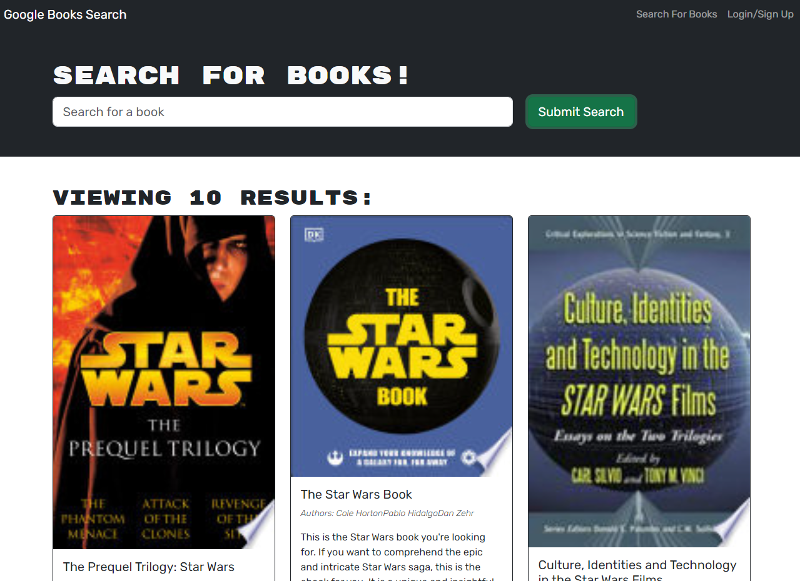

# Google Books Search Engine (Module 21 Challenge)

A simple Google Books Search Engine that allows users to make accounts, and save their favorite books.

## Table of Contents

- [Live Site](#live-site)
- [Installation](#installation)
- [Build](#build)
- [Usage](#usage)
- [Contributing](#contributing)
- [License](#license)

## Live Site

[Link to the live site](https://pacific-gorge-64385-2ce02c842083.herokuapp.com/)



## Installation

1. Clone the repository: `git clone https://github.com/username/repo.git`
2. Change to the project directory: `cd repo`
3. Install dependencies: `npm install`

## Build

To run the project locally, run the following command:

```bash
npm start
```

Open http://localhost:3000 to view it in the browser.

## License

This project is licensed under the MIT License - see the LICENSE.md file for details.
